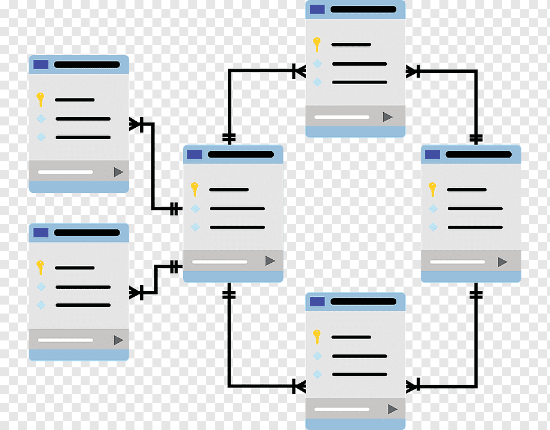

<p align="center">
  
</p>
<h1 align="center"> MyPigSQL </h1>
<p align="center">Join my discord: https://discord.gg/2QAPHbqrny </p>
<p align="center"> Async MySQL Library for PocketMine-MP </p>

### Current  Bugs

- There are `zombie SQLRequest` that can stay in the batches but they won't be executed multiple times and are extremely
  rare.

See [this merge](https://github.com/CupidonSauce173/MyPigSQL/pull/3) for a full update from `2.0.0-beta` to `3.0.0-beta`
.

## Library

| **Feature**                 | **State** | 
| --------------------------- |:----------:|
| MultiThreaded System        | ✔️ |
| SQLConnString Object        | ✔️ |
| SQLRequest Object           | ✔️ |
| SQLRequestExceptions        | ✔️ |
| SQLRequest Completions      | ✔️ |
| DispatchBatchThread         | ✔️ |
| DispatchBatchPool           | 🛠️ |

### Prerequisites

- Working MySQL Server.

### Why is this necessary?

Unlike other SQL libraries for PMMP, you don't need to specify your queries in another file. You can create your queries
on the fly while keeping a strict environment. This library also makes it possible to use multiple connections so you
can interact with multiple databases & tables. The creation of the SQLConnStrings & SQLRequests are very similar to how
you create packets in PMMP.

Note that every queries are prepared and you **must** supply the data types & the data variables (as array) when
creating a new SQLRequest.

### SQLConnString Creation

In order to send requests to the MySQL servers, you will surely need to create the SQLConnStrings which are the
informations needed for the DispatchBatchThread to execute the queries.

```php
# This is how to create a new SQLConnString from the SQLConnString::create() function.
$sqlConn = SQLConnString::create(
        'MainDatabase', # Name of the SQLConnString.
        '127.0.0.1', # host/address of the server.
        'mainUser', # Username to connect.
        'mainUserPassword', # User password.
        'notifications', # Database used.
        3306, # Port of the server, set to 3306 by defaulté
        true); # If has to validate. Is set to true by default.

# This is how to create it from the functions within it.
$connString = new SQLConnString();
$connString->setName('MainDatabase');
$connString->setAddress('127.0.0.1');
$connString->setUsername('mainUser');
$connString->setPassword('mainUserPassword');
$connString->setDatabase('notifications');
$connString->setPort(3589); # 3306 is the default port if none is supplied.
$connString->validate();
```

There are quite a few variables you can give to the SQLConnString object. Here's a table of the different variables.

| **Property** | **DataType** | **Description** | 
| ------------ | :---------- | :------------- | 
| $name | string | The name of the connection. | 
| $address | string | The host/address of the server server. | 
| $username | string | The username used to connect. | 
| $password | string | The password of the user. | 
| $database | string | The database used. | 
| $port | int | The port of the server. |

#### SQLConnString::validate();

This function will validate the connection when created. If there is a problem, the function will throw a
SQLRequestException with the message from the mysqli connection error. It is not obligated to validate a connection if
you know that it will work but note that if you use SQLConnString::create(), you must specify at the end with a false.

#### How to work with SQLConnString?

When you successfully created your SQLConnString object & validated (optional), you will need to register it to the list
of SQLConnStrings, for that, you simple need to use one line of code, here it is :

```php
MyPigSQL::registerStringConn($connString); # Returns true if successful
```

This function will throw a SQLRequestException if you try to register two SQLConnStrings with the same
name (`$connString->getName()`)
If for some reason you need to also unregister it, you can use this function:

```php
MyPigSQL::unregisterStringConn($connString); # Returns true if successful
```

Here is the list of functions related to the SQLConnString object.

```php
MyPigSQL::getSQLConnStringByName($connName); # Returns SQLConnString object or throws SQLRequestException.
MyPigSQL::unregisterStringConn($SQLConnString); # Unregisters the SQLConnString object (must be supplied with the object).
MyPigSQL::unregisterStringConnByName($SQLConnStringName); # Unregisters the SQLConnString object by name.
MyPigSQL::registerStringConn($connString); # Registers the SQLConnString (must be supplied with the object).

# ['address' => $address, 'username' => $user, 'password' => $password, 'database' => $database, 'port' => $port]
MyPigSQL::validateConnString($connStringData); # Will validate the data to create a SQLConnString.
```

### SQLRequest Creation

When you are done with creating & registering your SQLConnStrings, you will finally be able to create new SQLRequests.
The way you make them is exactly the same as how you create SQLConnStrings. You can use `SQLRequest::create()`
or `$request = new SQLRequest()`. Here are two examples:

```php
# This is how to create a new Utils from the Utils::create() function.
$requestTwo = SQLRequest::create(
        'SELECT * FROM PlayerData WHERE xuid = ?',
        's',
        [$player->getUniqueId()->toString()],
        self::getSQLConnStringByName('MainDatabase'),
        function (array $data) use ($player){
            $player->sendMessage("Welcome {$player->getName()}, you have {$data['kills'] kills!}");
        }
);
# This is how to create it from the functions within it.
$request = new SQLRequest();
$request->setQuery("SELECT * FROM FriendRequests WHERE id = ?");
$request->setDataTypes('s');
$request->setDataKeys([$player->getUniqueId()->toString()]);
$request->setConnString(MyPigSQL::getSQLConnStringByName('MainDatabase'));
$request->setCallable(function(array $data) use ($player){
        $player->sendMessage->('Wow, this is very fine! Here is when the relation has been created: ' . $data['reg_date']);
});

# Here is a real-world example of a fully implemented command using MyPigSQL.
    /**
     * @param CommandSender $sender
     * @param string $commandLabel
     * @param array $args
     * @throws SQLRequestException
     */
    public function execute(CommandSender $sender, string $commandLabel, array $args): void
    {
        if (!$sender->hasPermission(DefaultPermissions::ROOT_OPERATOR)) {
            $sender->sendMessage(Translation::getMessage('noPermission'));
            return;
        }
        if (!isset($args[1])) {
            $sender->sendMessage(Translation::getMessage('usageMessage', [
                'usage' => $this->getUsage()
            ]));
            return;
        }
        if (!is_numeric($args[1])) {
            $sender->sendMessage(Translation::getMessage('notNumeric'));
            return;
        }

        $player = $this->getCore()->getServer()->getPlayerExact($args[0]);
        MyPigSQL::addQueryToBatch(SQLRequest::create(
            'UPDATE players SET shards = shards + ? WHERE username = ?',
            'ss',
            [$args[1], $args[0]],
            MyPigSQL::getSQLConnStringByName('mainDB'),
            function(?array $data) use ($sender, $player, $args){
                $name = $args[0];
                if($player instanceof CorePlayer){
                    $player->addShards((int)$args[1]);
                    $name = $player->getName();
                }
                $sender->sendMessage(Translation::getMessage('addShardsSuccess', [
                    'amount' => TF::GREEN . '' . $args[1],
                    'name' => TF::GOLD . $name
                ]));
            }
        ));
    }
```

There are quite a few variables you can give to the SQLRequest object. Here's a table of the different variables.

| **Property** | **DataType**   | **Description** | 
| ------------ | :------------- | :------------- |
| $query | string | The query string. | 
| $dataTypes | string | The variable types used in the prepared statement. | 
| $dataKeys | array |The variables used in the prepared statement. | 
| $connString | SQLConnString | The SQLConnString object used for the request. | 
| $validated | bool | If the request has been sent to the MySQL server. | 
| $id | string | The id of the request. |

To register your query in the next batch of queries to be sent, you need to use this simple line of code:

```php
MyPigSQL::addQueryToBatch($request); # NOTE: MIGHT BE CHANGED TO addRequestToBatch().
```

Here is a list of the other functions related to SQLRequests.

```php
MyPigSQL::addQueryToBatch($request); # Will register the request to the batch.
MyPigSQL::removeQueryFromBatch($id, $batch); # Will unset the request from the batch, must be supplied with the request's id & batch.
MyPigSQL::getQueryFromBatch($id); # Will return the Utils object from the batch, must be supplied with the request's id.
```

### DispatchBatchPool

`New Since 3.0.0-beta`
This class extends `Pool` and has, for now, no methods. But the end goal will be to let users create their own batches
of requests and send them over a custom `DispatchBatchPool ` where they will be able to set a batch, the amount
of `DispatchBatchThread` they want in them and other few options. The batch will be divided by the amount
of `DispatchBathThread` the user set.

### Notes

1. `MyPigSQL::addQueryToBatch($request);` might be changed to `MyPigSQL::addRequestToBatch($request);`.
2. `SQLRequest::setDataKeys($dataList);` might be changed to `SQLRequest::setDataInput($dataList);`.
3. You can, if you do not want to register a new SQLConnString, create an SQLConnStrig without
   a `$name` (`SQLConnString::setName($name)`) by making it `null` when creating it.
4. A thread for each SQLConnStrings might be implemented to speed up the execution of the batch.

### Why this?

I made this plugin in my spare time because I didn't want to use another library for my network and because I am
planning to connect all my other systems (PigNotify, PigFriend & more to come) "together". My only problem was the use
of threads for each plugins so this library fixes the issue by using one thread for all other systems.
